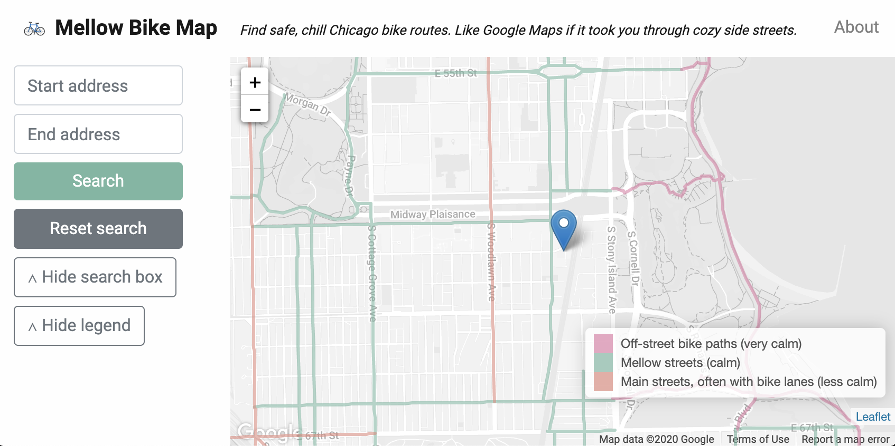

# Mellow Bike Map

🚲 Web app and routing API for finding safe, chill bike routes. Like Google Maps if it took you through cozy side streets.



## Developing

Development requires Docker and Docker Compose.

Build containers:

```
docker-compose -f docker-compose.yml -f docker-compose.db.yml build
```

Run migrations:

```
docker-compose run --rm app ./manage.py migrate
```

Import the data (note that the full data import can take quite a bit of memory,
so make sure to adjust your Docker preferences to allow Docker at least 6GB of
RAM):

```
docker-compose -f docker-compose.yml -f docker-compose.db.yml run --rm make
```

Start the app service:

```
docker-compose up
```

The app will be available on http://localhost:8000.

## Mapping

To begin mapping, make sure you've created an admin user with
`docker-compose run --rm app ./manage.py createsuperuser` and log in to the
mapping dashboard at http://localhost:8000/neighborhoods.

On this page, you'll see a map of neighborhoods along with the routes that have
already been mapped above a table with links to edit those neighborhoods.

### Adding neighborhoods

If you're mapping for this project, there are most likely already a set of
neighborhoods available for you to choose from at http://localhost:8000/neighborhoods,
in which case you can skip to [Adding routes](#adding-routes).

However, if you need to add a new neighborhood, you can do so by selecting the
"Create new neighborhood" button at the top-right corner of the page and
defining a name, slug, and a bounding box for the new neighborhood.

To edit the name, slug, or bounding box for an existing neighborhood, choose the
"Edit neighborhood" link next to the neighborhood's name in the table. Editing
a neighborhood's bounding box is particularly important because it will change
the filter for the underlying streets that are available when you edit routes,
streets, or paths for that neighborhood.

### Adding routes

On http://localhost:8000/neighborhoods, Find a neighborhood to map and choose one of the
following options:

* **Edit routes**: Add official bike routes in this neighborhood (non-mellow streets).
* **Edit streets**: Add mellow streets in this neighborhood.
* **Edit paths**: Add protected off-street bike routes to this neighborhood.

### Exporting routes

To export a set of mapped routes and submit it in a pull request, use the Django
`dumpdata` command to output the data to a fixture file using the name of the
region you've mapped. For example, use this command to export the North Side:

```
docker-compose run --rm app ./manage.py dumpdata mbm.mellowroute -o mbm/fixtures/north-side.json
```

Then add this fixture file to version control and commit it:

```
git add mbm/fixtures/north-side.json
git commit
```
